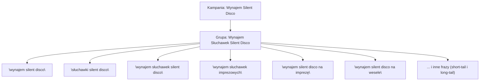

# Strategia kampanii Google Ads (wynajem słuchawek Silent Disco)

## Streszczenie
Kampania Google Ads Search zostanie skierowana na usługę **wynajmu słuchawek Silent Disco** oferowaną przez Cichoszau (całopolska firma eventowa). Głównym celem jest generowanie leadów (zapytań ofertowych) od firm i osób prywatnych organizujących eventy (imprezy firmowe, wesela, integracje) w całej Polsce. Grupa docelowa ceni nowoczesne atrakcje („cicha dyskoteka”) z profesjonalną obsługą techniczną. Istotnymi cechami oferty są kompleksowość (sprzęt + DJ + obsługa) i innowacyjny sprzęt (autorska aplikacja do zarządzania słuchawkami). 

Wstępna analiza konkurencyjnych fraz (np. **Silent Disco Party**, **cicha impreza**, **wynajem sprzętu eventowego**) wskazuje, że reklama powinna koncentrować się na frazach związanych bezpośrednio z „Silent Disco” i „wynajmem słuchawek”. Aby maksymalizować trafność, zastosujemy tylko 1–3 bardzo skoncentrowane grupy reklam (tu jedna główna grupa **„Wynajem słuchawek Silent Disco”**), co jest zgodne z zaleceniami Google: każda grupa reklam powinna mieć wąskie, spójne tematycznie słowa kluczowe【3†L61-L64】. Dobrze pogrupowane słowa kluczowe poprawiają trafność reklam (Quality Score) i obniżają koszt kliknięcia【4†L108-L113】. Kampania ruszy na strategii *Maxymalizacja kliknięć* (aby szybko uzyskać dane o konwersjach)【10†L41-L44】, a następnie zoptymalizujemy ją pod konwersje (Target CPA) po uzyskaniu ≈50 konwersji.

**Założenia (braki danych):** Budżet testowy ok. 40–100 PLN/dzień (dowolnie do zatwierdzenia klienta). Brak określonego docelowego CPA (zacznijmy od maksymalizacji kliknięć). Lokalizacja: Polska (zmiana opcji lokalizacji na „Obecność”, by docierać tylko do osób fizycznie w Polsce). Słowa zastrzeżone konkurencji (np. ich brandy) pozostawiamy do rozważenia; na razie skupiamy się na ogólnych frazach konwersyjnych. 

## Grupy reklam
- **Wynajem słuchawek Silent Disco** – jedna główna grupa reklam zawierająca słowa związane z wynajmem zestawów Silent Disco i organizacją imprez *„cichej dyskoteki”*. Cel: wyświetlać reklamy osobom poszukującym tej konkretnej usługi (w całej Polsce).   

W naszej strukturze wykorzystujemy zasadę „tema-konkretny produkt/usługa”, co jest w zgodzie z najlepszymi praktykami Google Ads【3†L61-L64】【4†L108-L113】. W pierwszej fazie testowej cała kampania obejmuje tę grupę, aby maksymalnie skupić budżet na frazach z najwyższym potencjałem konwersji (bez rozbijania na mniejsze kategorie, które mogłyby rozproszyć efektywność). W kolejnych etapach (po zebraniu danych) można rozważyć dodatkowe grupy np. *„Silent Disco – event”* czy *„Wynajem sprzętu na imprezę”*, jeśli będzie potrzeba dalszego rozróżnienia.

### Grupa reklam **„Wynajem słuchawek Silent Disco”**  

**Short-tail (Min. 20):**  
"wynajem silent disco", "słuchawki silent disco", "wynajem słuchawek silent disco", "wypożyczenie silent disco", "wynajem słuchawek imprezowych", "silent disco event", "silent disco impreza", "silent disco wesele", "silent disco firma", "wynajem słuchawek eventowych", "silent disco polska", "wynajem silent disco polska", "silent disco warszawa", "silent disco wrocław", "silent disco kraków", "silent disco poznań", "silent disco gdańsk", "silent disco katowice", "silent disco łódź", "silent disco szczecin".  

**Long-tail (Min. 20):**  
"wynajem silent disco na imprezę", "wynajem silent disco na wesele", "wynajem silent disco na event", "wynajem silent disco dla firm", "wynajem silent disco na integrację", "wynajem silent disco na konferencję", "wynajem silent disco na urodziny", "wynajem silent disco na domówkę", "wynajem silent disco z dostawą", "wynajem silent disco cała polska",  
"wynajem słuchawek na event firmowy", "wynajem słuchawek na wesele", "wynajem słuchawek na firmę",  
"wypożyczenie słuchawek silent disco", "zestaw silent disco wynajem", "sprzęt silent disco wynajem", "organizacja silent disco event",  
"wynajem silent disco party", "wynajem silent disco fun", "wynajem słuchawek na imprezę firmową", "wynajem silent disco na event firmowy".  

Wszystkie powyższe frazy są w dopasowaniu do wyrażenia (cudzysłów) i zostały dobrane na podstawie analizy słów konkurencji oraz wyszukiwanych zapytań (duży wolumen, wysoka intencja zakupowa). Obejmuje to popularne terminy ogólne (*short-tail*) oraz bardziej szczegółowe frazy (*long-tail*), które odpowiadają problemom i potrzebom klienta (np. konkretne okazje: „na wesele”, „na imprezę firmową”). Brak duplikacji między short- i long-tail oraz brak ogólnych śmieciowych fraz (unikamy np. „gratis”, „opinie”).  

**Negatywne słowa kluczowe (dopas. do wyrażenia):**  
"spotify", "youtube", "mp3", "co to jest", "jak to działa", "poradnik", "nauka", "darmowa wersja", "za darmo", "sklep", "kup", "allegro", "olx", "youtube", "recenzja", "opinie", "ranking", "hifi", "nauszne", "douszne", "mikrofon", "sprzęt dj", "glosniki", "dj kurs".  

Lista negatywów wyklucza ruch niezwiązany z zakupem lub wynajmem (np. zapytania o darmowe źródła muzyki, zakup sprzętu, recenzje itp.), co zwiększy konwersyjność kampanii.  

## Implementacja i checklista
1. **Wklej słowa kluczowe** z grupy powyżej do ustawień grupy reklam (dopasowanie wyrażenie, cudzysłów). Nie stosuj dopasowania przybliżonego/broad.  
2. **Budżet** – zasugerujmy początkowy budżet **40–100 PLN/dzień** (pewnie ~50 PLN/dzień). Pozwoli to uzyskać dane o klikalności i konwersjach.  
3. **Strategia stawek** – ustaw *Maksymalizację kliknięć* (Maximize Clicks) jako strategię ustalania stawek【10†L41-L44】. System zacznie zbierać ruch i dane konwersji. Po osiągnięciu ~30–50 konwersji w miesiącu, przejdź do *Maksymalizacji konwersji* (docelowy CPA) z budżetem skalującym.  
4. **Ustawienia lokalizacji** – kieruj kampanię na *Polskę (obecność)*, aby docierać tylko do osób faktycznie przebywających w Polsce. Wyłącz opcję „zainteresowanie” (ustaw „Obecność: tylko osoby w lokalizacji”), ponieważ działamy wyłącznie w kraju.  
5. **Harmonogram** – sprawdzaj codziennie wstępne wyniki (CTR, CPC, ilość wyświetleń) pierwsze 1–2 dni. Pierwsza optymalizacja po ~1 tygodniu: usuń słabe frazy o zerowej liczbie wyświetleń.  
6. **Negatywne** – wprowadź podaną wyżej listę wykluczeń na poziomie kampanii od razu.  
7. **Reklamy** – utwórz co najmniej 2–3 reklamy tekstowe typu RSA (elastyczne) w grupie, zawierające frazy typu *„Wynajem Silent Disco”*, *„słuchawki na event”*, *„cała Polska”*. Wypisz mocne CTA (np. „Zarezerwuj termin już dziś”).
8. **Optymalizacja** – monitoruj konwersje (formularze/połączenia) i współczynnik CTR. Po ~2 tygodniach dokonaj optymalizacji: wycofaj frazy o niskiej konwersji, przetestuj nowe nagłówki w reklamach.  

## Schemat struktury kampanii

Powyższy diagram pokazuje jedną kampanię z jedną grupą reklam i przykładowymi frazami kluczowymi. Resztę słów dopasowania należy dodać analogicznie.  

## Porównanie fraz konkurencji vs propozycja
Poniższa tabela ilustruje typowe zapytania obserwowane u konkurentów (np. inne agencje Silent Disco) i nasze główne frazy. Frazy konkurencji są uproszczonymi przykładami:

| Fraz konkurencji (top 10)      | Proponowane frazy (nasze)        |
|-------------------------------|----------------------------------|
| silent disco party            | wynajem silent disco             |
| silent disco fun              | wynajem słuchawek silent disco    |
| cicha impreza                 | wynajem słuchawek imprezowych    |
| disco silent                  | wynajem silent disco na wesele   |
| ciche wesele                  | wynajem słuchawek na event firmowy |
| dj silent disco               | wypożyczenie silent disco        |
| słuchawki silent disco cena   | sprzęt silent disco wynajem      |
| wynajem sprzętu imprezowego   | organizacja silent disco event   |
| wynajem słuchawek na event    | wynajem silent disco cała polska |
| impreza w słuchawkach wynajem | wynajem silent disco na imprezę  |

Tabela pokazuje, że nasze frazy są bliższe intencji *wynajmu słuchawek Silent Disco* i zawierają zarówno ogólne wyszukiwania, jak i szczegółowe scenariusze. Konkurencja często używa ogólnych określeń typu „silent disco party” czy „ciche wesele”, a my precyzujemy je w naszą korzyść.  

**Źródła:**  
- Oficjalne wytyczne Google Ads dotyczące grup reklam i słów kluczowych【3†L61-L64】【4†L108-L113】【10†L41-L44】.  
- Strategie licytacji (Maximize Clicks) – Google Ads Help【10†L41-L44】.  

